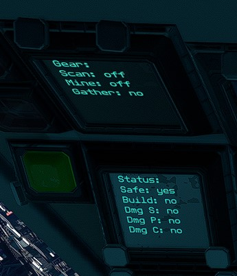

# Gear and Status Script
This script displays basic information about your ship

# Setup
1. Have a have 2 text-panels with fields set to ":Gear" and ":Status"

# Usage
1. Gear Screen displays information about your equpiment: Ore Scanner, Mining Laser, Ore Collector
2. Status Screen displays information about your enviroment: Safe zone status, Station Build ability, Damage to ship, Damage to Players, Damage from Collisions. 

# Note 
Refresh rate is about 2.6 second. 

# License
GNU GPLv3

# Credits
https://github.com/xyberviri Xyberviri#5609
